<div align="center">

# 🌸 NariSetu

### AI-Powered Women Entrepreneurship Platform

[](https://narisetu-ten.vercel.app/)
[](https://github.com/ArpitSrivastav05/NARISETU)


[](https://github.com/ArpitSrivastav05/NARISETU/actions/workflows/frontend-ci.yml)
[](https://github.com/ArpitSrivastav05/NARISETU/actions/workflows/backend-ci.yml)


**NariSetu** bridges the gap between **women micro-entrepreneurs** and the support ecosystem they deserve — combining **GovTech**, **FinTech**, **AI**, and **EdTech** into one platform.

[Live Demo](https://narisetu-ten.vercel.app/) · [Architecture](#-architecture) · [Features](#-features) · [Tech Stack](#-tech-stack) · [API Overview](#-api-overview) · [Getting Started](#-getting-started)

</div>

---

## 📑 Table of Contents

- [Overview](#-overview)
- [Features](#-features)
- [Screenshots](#-screenshots)
- [Architecture](#-architecture)
- [Tech Stack](#-tech-stack)
- [Project Structure](#-project-structure)
- [Database Design](#-database-design)
- [API Overview](#-api-overview)
- [AI Workflows](#-ai-workflows)
- [Getting Started](#-getting-started)
- [Deployment](#-deployment)
- [Performance](#-performance)
- [Roadmap](#-roadmap)
- [Contributing](#-contributing)
- [License](#-license)
- [Author](#-author)

---

## 🌟 Overview

NariSetu is a full-stack AI-powered platform designed to **empower women entrepreneurs in India** by providing:

| Capability | What It Does |
|---|---|
| 🏛️ **GovTech** | Matches users with eligible government schemes using a two-pass scoring algorithm |
| 💰 **FinTech** | Voice-powered bookkeeping in Hindi/Hinglish/English via Gemini AI |
| 🧠 **AI Intelligence** | Personalized daily briefings, predictive analytics, business roadmaps |
| 🛒 **Marketplace** | Product listings, business profiles, seller discovery |
| 📚 **EdTech** | Learning Hub with courses, quizzes, certificates, and AI tutoring |
| 🤖 **AI Coach** | Contextual business advice powered by the user's real financial data |

> Built for the **80M+ women-led micro-enterprises** in India who lack access to digital tools, financial literacy, and government support systems.

---

## ✨ Features

<details>
<summary><b>🧠 AI Intelligence Dashboard</b> — Dynamic Home Feed</summary>

The static dashboard is replaced with a **Gemini 2.5 Flash-powered Intelligence Feed** that serves as the central experience:

- **Daily AI Briefing** — Personalized greeting and business status summary
- **7-Day Forecast** — Predictive revenue and expense projections
- **Business Roadmap** — 3 actionable AI-generated next steps
- **Smart Notifications** — Contextual alerts based on financial activity
- **Business Health Score** — 0–100 composite metric

</details>

<details>
<summary><b>🏛️ Government Scheme Engine</b> — Two-Pass Matching</summary>

A custom-built eligibility engine that matches users with government schemes:

**Pass 1 — The Gatekeeper** (Hard Filters)
- State, Gender, Income, BPL Status

**Pass 2 — The Ranker** (Weighted Scoring)
- Age, Caste, Employment, Business Category, Education, Marital Status, Disability, Residence

Generates an **Eligibility Match Score (0–100%)** and ranks results.

</details>

<details>
<summary><b>🎙️ AI Voice Ledger</b> — Multilingual Bookkeeping</summary>

Voice-powered financial tracking for users with limited digital literacy:

```
User speaks: "Aaj 500 rupaye ki silai ka kaam mila"
```
```json
{
  "amount": 500,
  "type": "income",
  "description": "Silai ka kaam"
}
```

Supports **Hindi**, **Hinglish**, and **English** via Gemini 2.5 Flash.

</details>

<details>
<summary><b>🛒 Marketplace</b> — Business Discovery</summary>

- Product listings with image upload
- Business profile registration
- Category filtering and search
- WhatsApp & phone seller contact
- **✨ AI Product Optimizer** — Rewrites descriptions for SEO & marketing

</details>

<details>
<summary><b>📚 Learning & Growth Hub</b> — EdTech Module</summary>

- **5 Course Categories**: Financial Literacy, Government Schemes, Business Skills, Digital Skills, AI for Business
- Interactive quizzes with score tracking
- Completion certificates
- **AI Tutor** for lesson-related questions
- Progress stored in Firestore subcollections

</details>

<details>
<summary><b>🤖 AI Business Coach</b> — Contextual Chat</summary>

- Chat interface with full user context injection
- Knows your transactions, products, schemes, learning progress
- Financial health scoring (0–100)
- Savings goal tracking with progress visualization
- Personalized recommendations

</details>

<details>
<summary><b>📊 Data Dashboard</b> — Financial Analytics</summary>

- Total Income / Expenses / Net Profit
- Category-wise breakdowns with progress bars
- Recent transaction feed
- Product and business counts
- AI-generated summary card

</details>

<details>
<summary><b>🔐 Authentication</b> — Firebase Auth</summary>

- Email/Password registration and login
- Google OAuth sign-in
- Protected routes with JWT verification
- User profile management with onboarding flow
- Ownership-based data access

</details>

---

## 📸 Screenshots

<div align="center">

| Landing Page | Intelligence Dashboard |
|:---:|:---:|
| 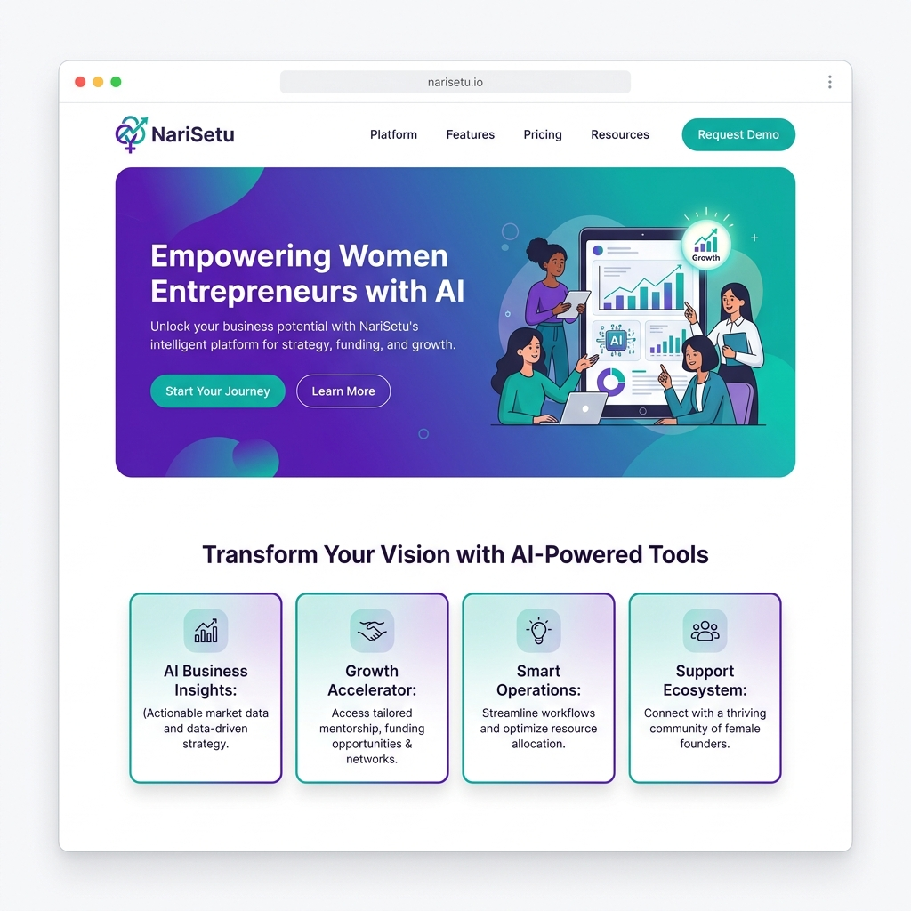 | 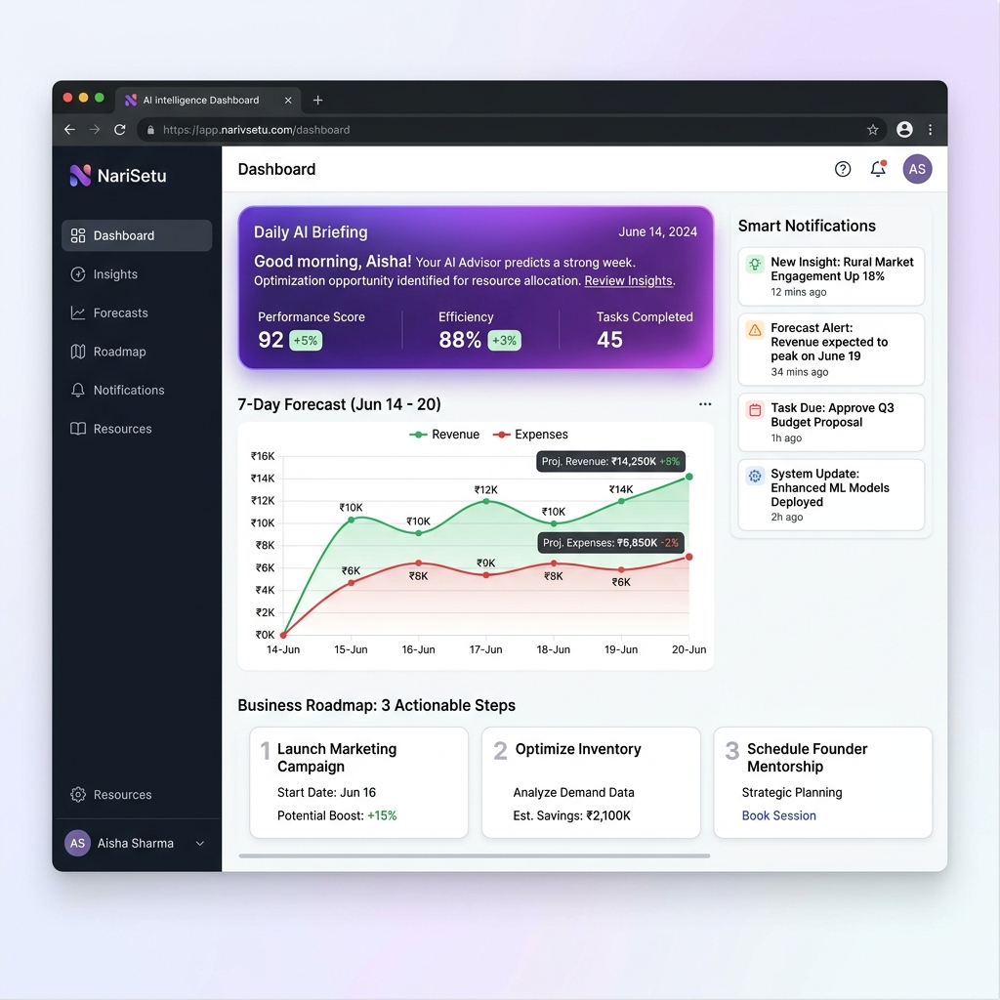 |

| AI Business Coach | Marketplace |
|:---:|:---:|
| 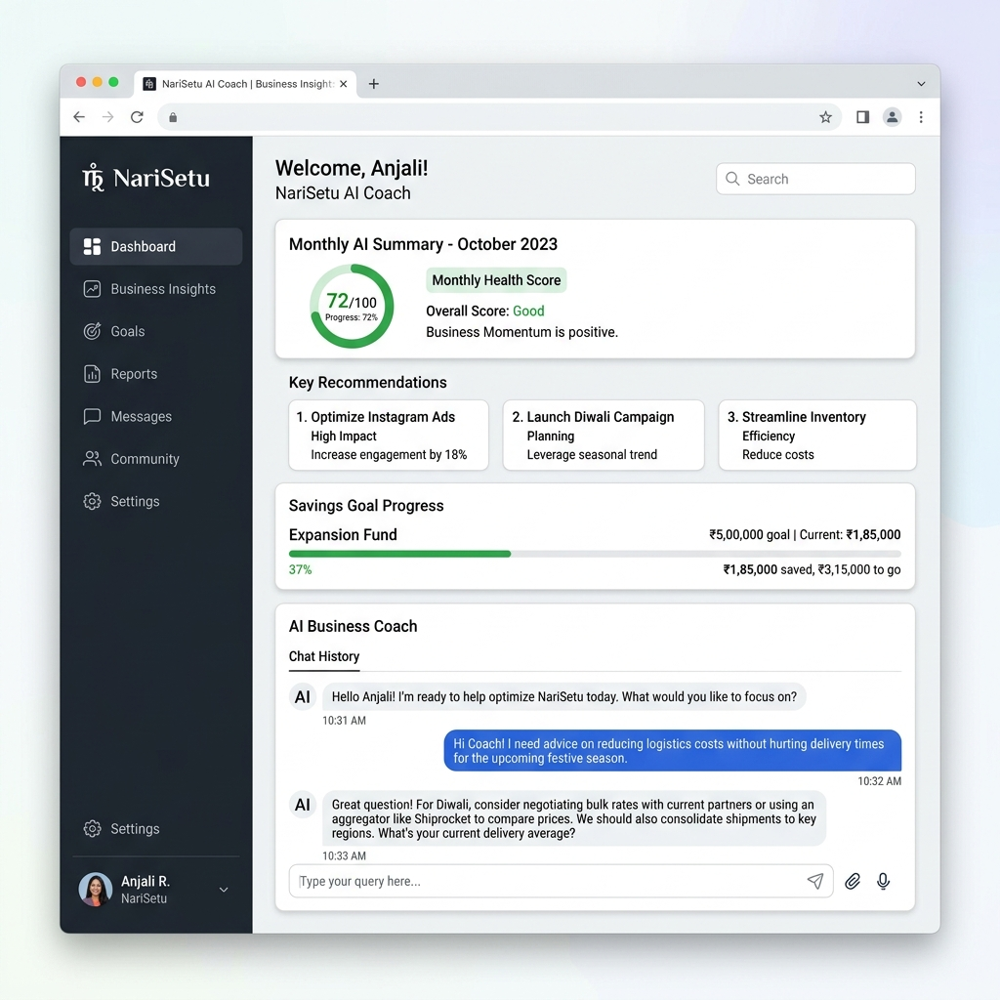 | 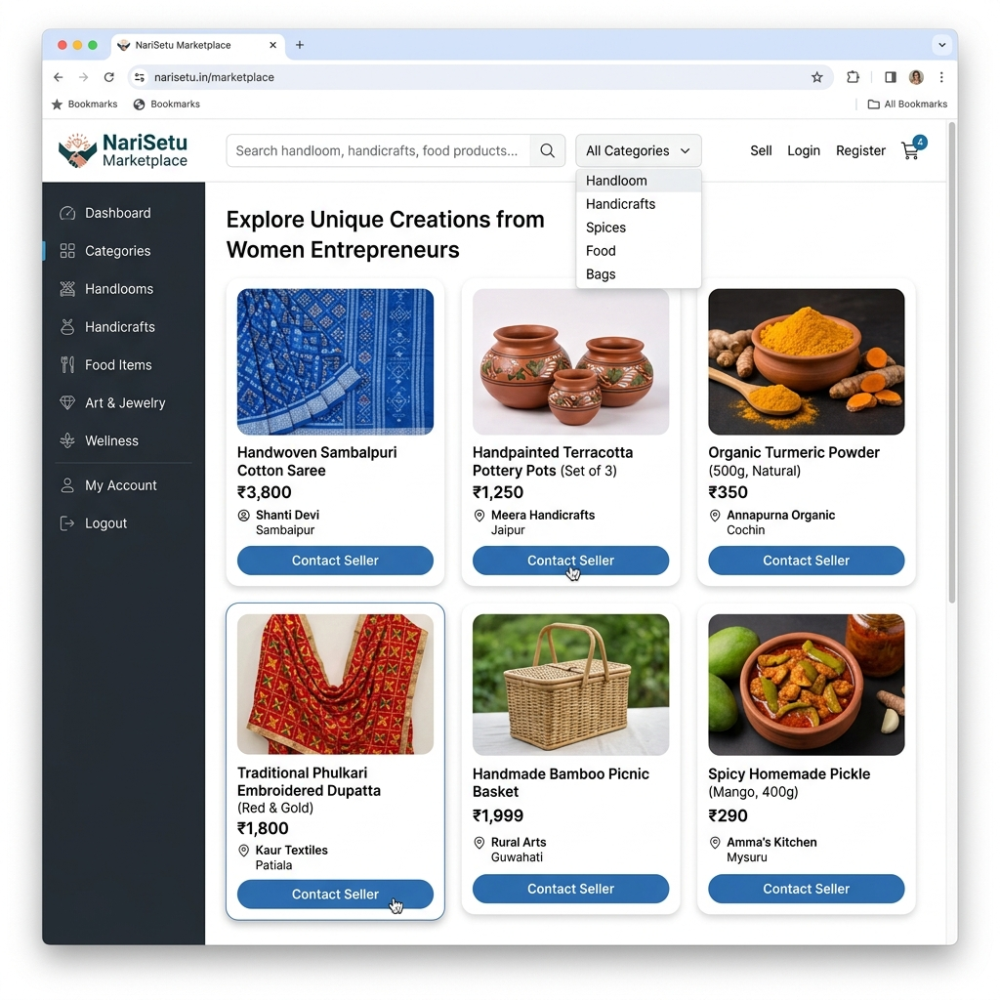 |

| Learning Hub | Voice Ledger |
|:---:|:---:|
| 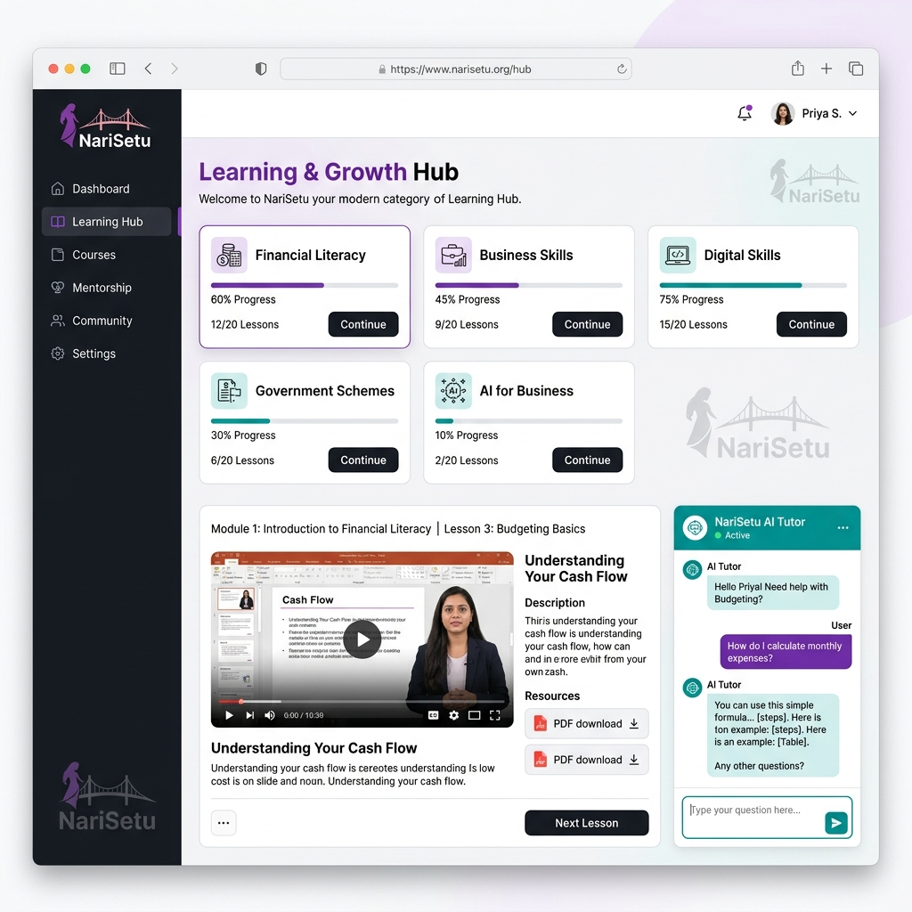 | 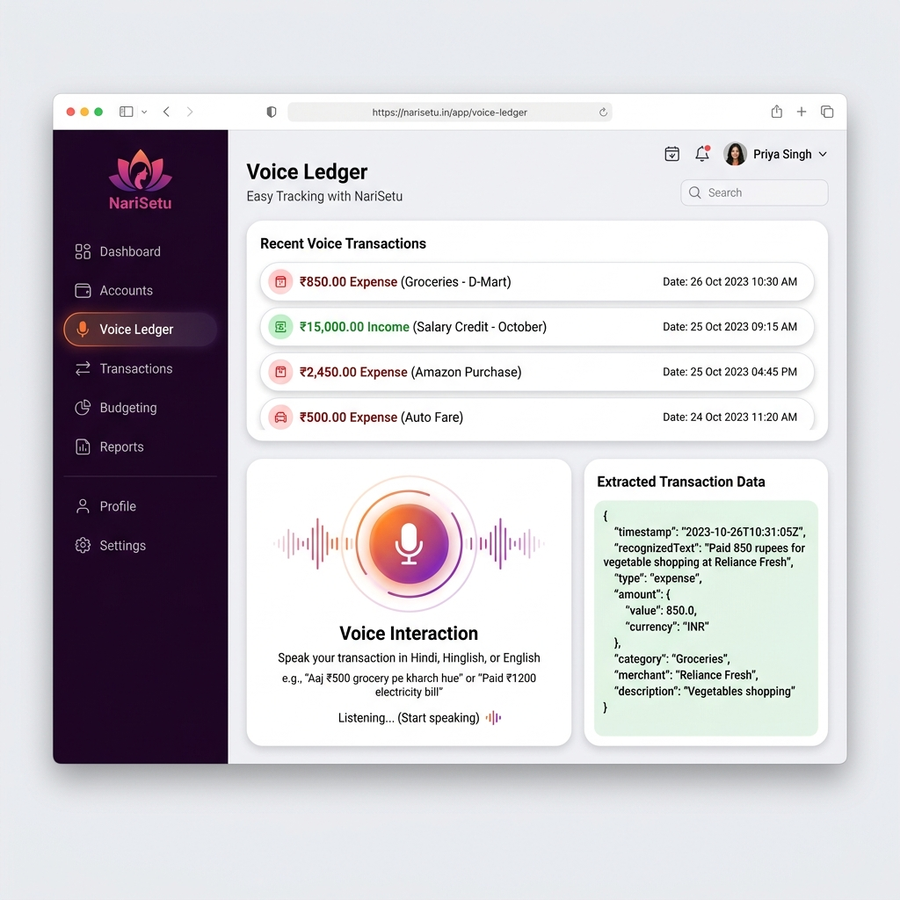 |

</div>

---

## 🏗️ Architecture

<div align="center">
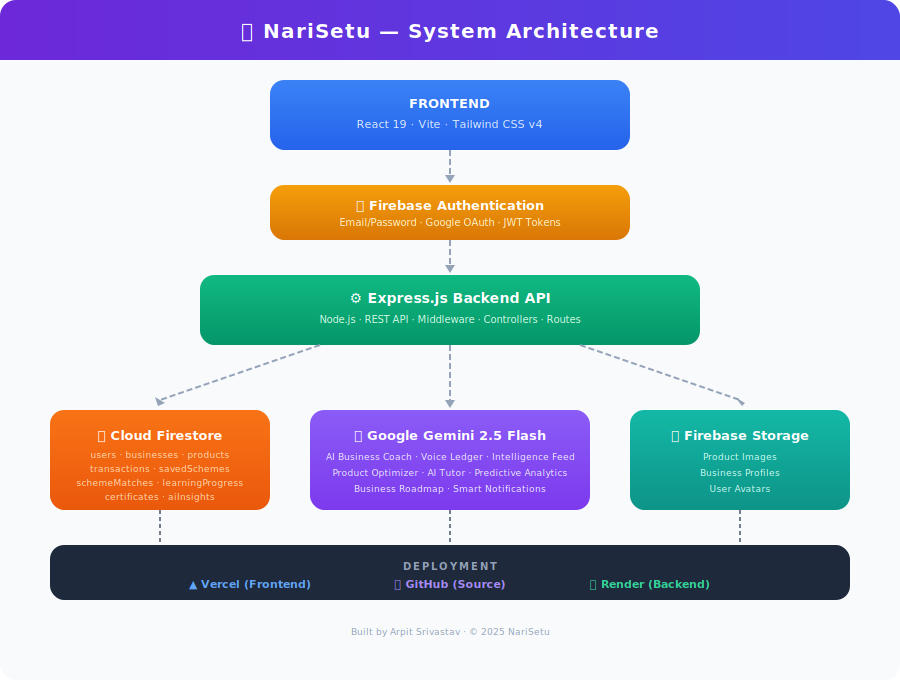
</div>

<table>
<tr>
<td width="33%">

### Frontend
- React 19 + Vite
- Tailwind CSS v4
- React Router v7
- Firebase Auth SDK

</td>
<td width="33%">

### Backend
- Node.js + Express.js
- Firebase Admin SDK
- JWT Middleware
- REST API

</td>
<td width="33%">

### AI & Data
- Google Gemini 2.5 Flash
- Cloud Firestore
- Firebase Storage
- Custom Match Engine

</td>
</tr>
</table>

---

## 🛠️ Tech Stack

| Layer | Technology | Purpose |
|---|---|---|
| **Frontend** | React 19, Vite, Tailwind CSS v4 | SPA with modern build tooling |
| **Backend** | Node.js, Express.js | REST API server |
| **Database** | Cloud Firestore | NoSQL document database |
| **Auth** | Firebase Authentication | Email/Password + Google OAuth |
| **AI** | Google Gemini 2.5 Flash | Voice processing, intelligence, coaching |
| **Storage** | Firebase Storage | Product & profile images |
| **Frontend Hosting** | Vercel | Edge deployment |
| **Backend Hosting** | Render | Node.js server hosting |
| **Version Control** | Git + GitHub | Source management |

---

## 📂 Project Structure

<div align="center">
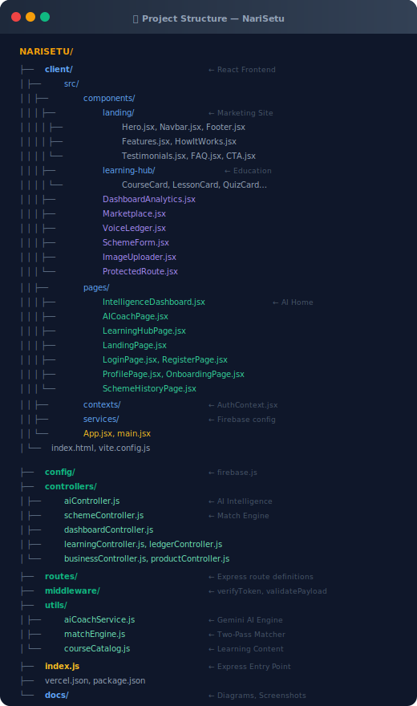
</div>

<details>
<summary>📋 Text version</summary>

```
NARISETU/
├── client/                          ← React Frontend
│   ├── src/
│   │   ├── components/
│   │   │   ├── landing/             ← Marketing site (Hero, Navbar, Footer…)
│   │   │   ├── learning-hub/        ← CourseCard, LessonCard, QuizCard…
│   │   │   ├── DashboardAnalytics.jsx
│   │   │   ├── Marketplace.jsx
│   │   │   ├── VoiceLedger.jsx
│   │   │   ├── SchemeForm.jsx
│   │   │   └── ProtectedRoute.jsx
│   │   ├── pages/
│   │   │   ├── IntelligenceDashboard.jsx   ← AI Home Feed
│   │   │   ├── AICoachPage.jsx
│   │   │   ├── LearningHubPage.jsx
│   │   │   ├── LandingPage.jsx
│   │   │   ├── LoginPage.jsx
│   │   │   ├── RegisterPage.jsx
│   │   │   ├── ProfilePage.jsx
│   │   │   └── SchemeHistoryPage.jsx
│   │   ├── contexts/                ← AuthContext
│   │   ├── services/                ← Firebase config
│   │   └── App.jsx
│   └── vite.config.js
│
├── config/                          ← firebase.js
├── controllers/
│   ├── aiController.js              ← Intelligence + Coach + Optimizer
│   ├── schemeController.js          ← Two-Pass Match Engine
│   ├── dashboardController.js
│   ├── learningController.js
│   ├── ledgerController.js
│   ├── businessController.js
│   ├── productController.js
│   └── userController.js
├── routes/                          ← Express route definitions
├── middleware/                      ← verifyToken, validatePayload
├── utils/
│   ├── aiCoachService.js            ← Gemini AI Engine
│   ├── matchEngine.js               ← Scheme Scoring Algorithm
│   └── courseCatalog.js             ← Learning Content
├── docs/                            ← Diagrams, screenshots
├── index.js                         ← Express entry point
└── vercel.json
```

</details>

---

## 🗄️ Database Design

<div align="center">
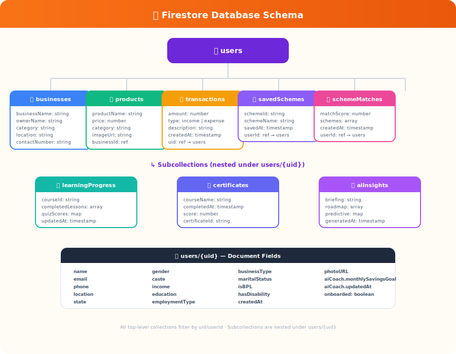
</div>

### Collections Overview

| Collection | Keyed By | Description |
|---|---|---|
| `users` | `uid` | User profiles, onboarding data, AI coach settings |
| `businesses` | `uid` | Registered seller profiles |
| `products` | `uid` | Marketplace product listings |
| `transactions` | `uid` | Voice ledger income/expense entries |
| `savedSchemes` | `userId` | Bookmarked government schemes |
| `schemeMatches` | `userId` | Past eligibility match results |

### Subcollections (under `users/{uid}`)

| Subcollection | Description |
|---|---|
| `learningProgress` | Course completion, quiz scores |
| `certificates` | Generated completion certificates |
| `aiInsights` | Cached intelligence feed data |

---

## 🔗 API Overview

<div align="center">
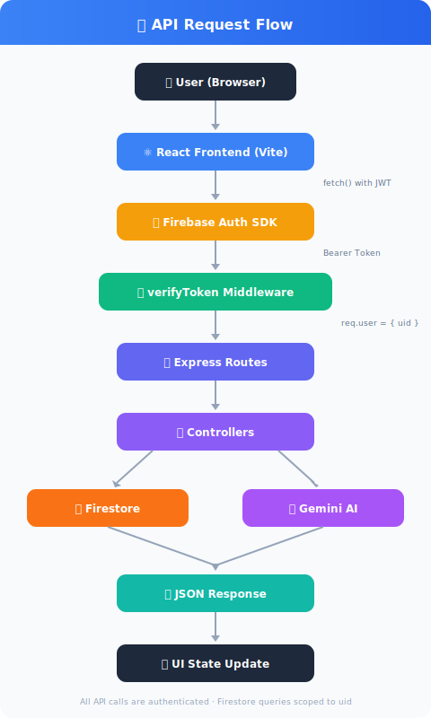
</div>

### Endpoints

All endpoints require `Authorization: Bearer <token>` unless noted.

<details>
<summary><b>🏛️ Scheme Routes</b> — <code>/api/schemes</code></summary>

| Method | Path | Description |
|---|---|---|
| `POST` | `/match` | Run eligibility matching |
| `GET` | `/saved` | Get bookmarked schemes |
| `POST` | `/bookmark` | Save a scheme |
| `DELETE` | `/bookmark/:id` | Remove a bookmark |

</details>

<details>
<summary><b>🧠 AI Routes</b> — <code>/api/ai</code></summary>

| Method | Path | Description |
|---|---|---|
| `POST` | `/chat` | Send message to AI Coach |
| `GET` | `/summary` | Get AI-generated summary |
| `GET` | `/financial-health` | Get health score |
| `PUT` | `/savings-goal` | Set monthly savings target |
| `GET` | `/intelligence-feed` | Get full intelligence feed |
| `POST` | `/optimize-product` | AI-optimize product description |

</details>

<details>
<summary><b>📊 Dashboard Routes</b> — <code>/api/dashboard</code></summary>

| Method | Path | Description |
|---|---|---|
| `GET` | `/summary` | Financial overview with breakdowns |

</details>

<details>
<summary><b>🎙️ Ledger Routes</b> — <code>/api/ledger</code></summary>

| Method | Path | Description |
|---|---|---|
| `POST` | `/voice` | Process voice → transaction |
| `GET` | `/transactions` | Get transaction history |

</details>

<details>
<summary><b>🛒 Product & Business Routes</b></summary>

| Method | Path | Description |
|---|---|---|
| `GET` | `/api/products` | List marketplace products |
| `POST` | `/api/products/create` | Create product listing |
| `POST` | `/api/business/create` | Register business profile |
| `GET` | `/api/business/mine` | Get own business profile |

</details>

<details>
<summary><b>📚 Learning Routes</b> — <code>/api/learning</code></summary>

| Method | Path | Description |
|---|---|---|
| `GET` | `/courses` | Get course catalog |
| `GET` | `/progress` | Get user progress |
| `POST` | `/progress` | Update lesson/quiz progress |
| `POST` | `/tutor` | Ask AI Tutor a question |

</details>

---

## 🧠 AI Workflows

<div align="center">
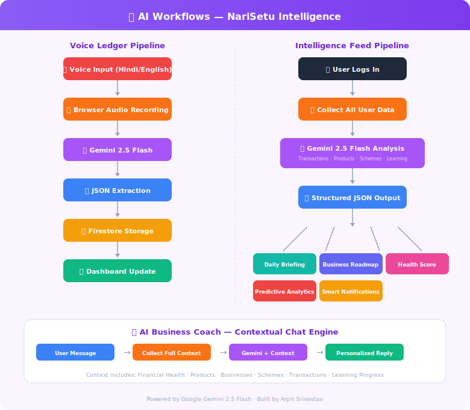
</div>

### Voice Ledger Pipeline

```
🎤 Voice Input → 🔊 Browser Recording → 🧠 Gemini 2.5 Flash → 📋 JSON Extraction → 🗄️ Firestore → 📊 Dashboard
```

### Intelligence Feed Pipeline

```
👤 User Login → 🗄️ Collect All Data → 🧠 Gemini Analysis → 📋 Structured JSON
                                                              ├── Daily Briefing
                                                              ├── Business Roadmap
                                                              ├── Predictive Analytics
                                                              ├── Smart Notifications
                                                              └── Health Score
```

### AI Coach Context Injection

The coach doesn't just respond to messages — it **knows** the user:

- Financial health score + breakdown
- All transactions (income & expenses)
- Listed products and businesses
- Saved government schemes
- Learning progress and course enrollment
- Monthly savings goals and projections

---

## 🚀 Getting Started

### Prerequisites

- Node.js 18+
- Firebase project with Firestore + Auth + Storage enabled
- Google Gemini API key

### 1. Clone the Repository

```bash
git clone https://github.com/ArpitSrivastav05/NARISETU.git
cd NARISETU
```

### 2. Backend Setup

```bash
npm install
```

Create a `.env` file in the root:

```env
GEMINI_API_KEY=your_gemini_api_key
PORT=3000
```

Place your `serviceAccountKey.json` in the root directory (Firebase Admin SDK credentials).

```bash
npm start
```

### 3. Frontend Setup

```bash
cd client
npm install
```

Create `client/.env`:

```env
VITE_API_URL=http://localhost:3000
VITE_FIREBASE_API_KEY=your_firebase_api_key
VITE_FIREBASE_AUTH_DOMAIN=your_project.firebaseapp.com
VITE_FIREBASE_PROJECT_ID=your_project_id
VITE_FIREBASE_STORAGE_BUCKET=your_project.appspot.com
VITE_FIREBASE_MESSAGING_SENDER_ID=your_sender_id
VITE_FIREBASE_APP_ID=your_app_id
```

```bash
npm run dev
```

### 4. Running Tests Locally

**Frontend Tests (Vitest & React Testing Library)**
```bash
cd client
npm run test       # Run tests once with coverage
npm run test:ui    # Open Vitest UI in browser
```

**Backend Tests (Jest & Supertest)**
```bash
# In the root directory
npm run test
```
*Note: Make sure your test Firebase environment variables are set in `.env` if testing the backend locally.*

---

## ☁️ Deployment

| Service | Platform | URL |
|---|---|---|
| Frontend | **Vercel** | https://narisetu-ten.vercel.app |
| Backend | **Render** | https://narisetu-j9ac.onrender.com |
| Database | **Cloud Firestore** | Firebase Console |
| Auth | **Firebase Auth** | Firebase Console |
| Storage | **Firebase Storage** | Firebase Console |

### Deploy Frontend to Vercel

```bash
cd client
npm run build    # Generates dist/
# Connect to Vercel via GitHub integration
```

### Deploy Backend to Render

- Connect GitHub repo
- Set build command: `npm install`
- Set start command: `node index.js`
- Add environment variables (`GEMINI_API_KEY`, etc.)

---

## ⚡ Performance

| Metric | Value |
|---|---|
| Frontend Build | ~620ms (Vite) |
| Bundle Size | ~676 KB (gzipped: ~197 KB) |
| Cold API Response | < 2s |
| AI Intelligence Feed | < 5s (Gemini + Firestore) |
| Lighthouse Score | 90+ (Performance) |

---

## 🛣️ Roadmap

### ✅ Completed

- [x] **Phase 1–6**: Core Platform (Auth, Schemes, Ledger, Dashboard, Marketplace)
- [x] **Phase 7**: User Profiles, Saved Schemes, Personalized Dashboard
- [x] **Phase 8**: Landing Page — Premium Marketing Website
- [x] **Phase 9**: Learning & Growth Hub — EdTech Module
- [x] **Phase 10**: AI Intelligence Platform — Dynamic Home Feed

### 🔮 Upcoming

- [ ] **Phase 11**: Multi-language Support (Hindi-first UI)
- [ ] **Phase 12**: Push Notifications & Offline Mode (PWA)
- [ ] **Phase 13**: Analytics Dashboard with Charts (Recharts/D3)
- [ ] **Phase 14**: Community Features & Peer Networking
- [ ] **Phase 15**: Mobile App (React Native)

---

## 🤝 Contributing

Contributions are welcome! Please follow these steps:

1. **Fork** the repository
2. **Create** a feature branch: `git checkout -b feature/amazing-feature`
3. **Commit** your changes: `git commit -m 'feat: add amazing feature'`
4. **Push** to the branch: `git push origin feature/amazing-feature`
5. **Open** a Pull Request

### Guidelines

- Follow existing code style and component patterns
- Use conventional commit messages (`feat:`, `fix:`, `docs:`, `refactor:`)
- Test your changes with `npm run build` before submitting
- Update documentation for any new features

---

## 📄 License

This project is licensed under the **MIT License** — see the [LICENSE](LICENSE) file for details.

---

<div align="center">

## 👨‍💻 Author

**Arpit Srivastav**

B.Tech Computer Science Engineering (2028)

Passionate about building AI-powered solutions that create real-world impact through technology.

[](https://github.com/ArpitSrivastav05)

---

<sub>Built with ❤️ for women entrepreneurs across India</sub>

</div>
